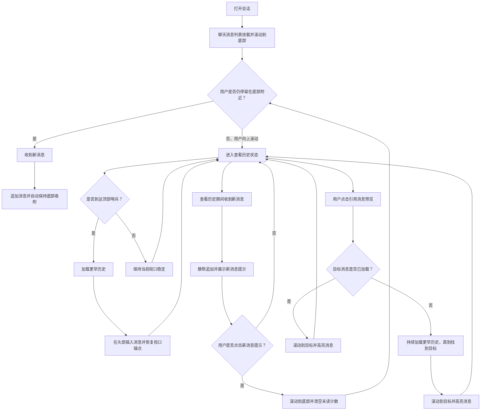

# 聊天消息列表设计

日期：2026-05-09

## 目标

将 `ApiDemo` 中的会话消息列表升级为更接近生产环境的聊天消息列表，支持大体量历史记录、图片附件下的稳定滚动、引用消息跳转、列表顶部历史加载，以及能够尊重用户阅读意图的底部吸附行为。

第一版实现目标为
`apps/workbench/src/pages/dashboard/api-demo/components/ConversationPanel.tsx`
及其相关的本地页面代码。此次工作聚焦于聊天消息列表行为，不修改后端契约。

## 范围

包含在范围内：

- 支持渲染数千条消息，而不是让全部 DOM 一次性展开。
- 防止图片附件加载完成后出现可见的滚动跳动。
- 支持点击引用消息预览后跳转到原始消息，并进行短暂高亮。
- 当用户滚动到顶部时加载更早的历史记录。
- 仅当用户仍接近底部时，新增消息才自动滚动到底部。
- 在当前激活会话切换时清理聊天消息列表交互状态。
- 第一版将引用消息元数据保留在聊天消息列表视图模型层，不修改共享 `ChatMessage` 类型。

不包含在范围内：

- 为引用元数据或按消息定位历史记录而进行的后端 API 变更。
- 共享的全局聊天消息列表 store。
- 定向历史回填的硬性上限。
- 基于 `messageId` 或时间游标的精确服务端跳转支持。
- 第一版中，不修改 `packages/types` 或 `apps/workbench/src/pages/dashboard/api-demo/types.ts` 来承载仅供引用 UI 使用的字段。

## UX 流程图

下面的 Mermaid 图总结了主要的、用户可感知的聊天消息列表流程：

## 已解决的开放设计决策

- 使用虚拟化，而不是继续扩展当前“全部渲染”的列表实现。
- 第一版不将仅供引用使用的字段放入共享 `ChatMessage` 类型。
- 目前将引用元数据保留在聊天消息列表视图模型层，而不是立即引入全局 store。
- 当引用目标尚未加载时，自动持续加载更早历史；找到后再跳转并高亮。

## TODO

- 增加一个两阶段路线图：
  - phase 1 实现当前这种自动向前回填历史的行为
  - phase 2 为深历史引用跳转升级更智能的搜索策略
- 增加具备明确上限的定向历史回填流程
- 支持基于 `messageId` 或时间游标加载目标附近的历史切片
- 如果引用行为扩展到多个页面，再评估是否需要专门的 `timeline metadata store`
- 如果未来引入 `timeline metadata store`，其中只存可共享的引用/索引元数据，滚动实例状态仍保留在聊天消息列表本地
- 如果后续可以拿到图片固有尺寸，则预先分配纵横比空间，进一步减少回流

## 当前实现概览

当前 `ConversationPanel` 通过在可滚动容器中直接遍历 `messages` 来渲染消息列表。这个实现足够简单，但不具备以下能力：

- 面向大历史记录的虚拟化
- 在头部插入更早历史时恢复锚点位置
- 图片导致高度变化时重新测量并补偿滚动位置
- 引用预览渲染与跳转处理
- 面向新增消息的底部吸附意图处理

`ConversationPanel` 当前已经具备正确的高层布局边界，包括头部和输入框区域。新的行为应通过抽取专门的聊天消息列表层来引入，而不是继续把当前文件扩展成一个同时承担布局、渲染和滚动控制职责的组件。

## 架构

在 api-demo 页面下引入专门的聊天消息列表子系统：

- `ConversationPanel`
  - 保留头部、空状态/加载状态，以及 `ChatComposer`
  - 将归一化后的消息数据和回调传入聊天消息列表
- `ConversationTimeline`
  - 负责虚拟化、滚动意图、顶部历史加载、引用跳转和高亮状态
- `ConversationRow`
  - 渲染单条消息行，包括系统消息和普通消息气泡
- `QuotedMessagePreview`
  - 渲染消息中的引用摘要，并触发跳转行为
- `MessageAttachments`
  - 渲染图片和文件附件，并在图片布局确定后向聊天消息列表回报
- `useConversationTimeline`
  - 封装聊天消息列表控制逻辑，尤其是滚动控制权、锚点恢复、跳转时序和高亮生命周期

这样可以把聊天消息列表交互逻辑限制在页面特性内部，避免把依赖具体 DOM 实例的行为污染到共享的全局 store 中。

## 数据模型策略

第一版不修改共享的 `ChatMessage` 类型。引用相关的元数据通过聊天消息列表本地视图模型来表达。

推荐结构：

- `ChatMessage`
  - 保持接近当前页面层与 API 层的数据结构
- `TimelineMessage`
  - 在聊天消息列表适配层内部派生
  - 可以包含仅用于引用 UI 的元数据，例如：
    - `quotedMessageId`
    - `quotedPreviewText`
    - `quotedPreviewAuthor`

这样可以把引用行为限制在聊天消息列表内部，同时为未来的 API 支持预留空间。如果之后引用元数据需要在多个页面之间共享，团队可以再评估是否引入专门的聊天消息列表元数据 store，而不必把滚动状态提升为全局状态。

## 组件契约

`ConversationTimeline` 应接收一个聚焦的接口：

- `messages: ChatMessage[]`
- `hasOlder: boolean`
- `isLoadingOlder: boolean`
- `loadOlder: () => Promise<void>`
- 如本地 demo 数据需要，也可补充可选回调或适配器来解析引用关系

聊天消息列表内部负责构建：

- `TimelineMessage[]`
- `messageId -> index` 查找映射
- 临时高亮状态
- 本地跳转任务状态
- 图片测量与锚点恢复相关的记录

父组件继续负责消息所有权与历史分页数据。

## 滚动状态模型

聊天消息列表应将滚动行为视为一个小型状态机，而不是一组彼此无关的 effect。

核心状态：

- `isAtBottom`
  - 当视口距离底部小于某个阈值时为 true
- `isReviewingHistory`
  - 当用户主动离开底部区域后为 true
- `isLoadingOlder`
  - 当正在向前补载更早历史时为 true
- `pendingJumpTargetId`
  - 当前请求跳转的引用目标
- `highlightedMessageId`
  - 当前需要临时高亮显示的消息
- `unseenNewMessageCount`
  - 用户正在查看历史期间，新追加但未读的消息数量
- `prependAnchorSnapshot`
  - 在头部插入历史时，用于保持视口位置的可见锚点快照

滚动控制权的优先级顺序：

1. 引用消息跳转
2. 头部插入历史后的锚点恢复
3. 新增消息的底部吸附行为
4. 被动的用户滚动

这个顺序可以避免多个 effect 同时争夺同一个滚动容器的控制权。

## 虚拟化策略

聊天消息列表使用 `@tanstack/react-virtual`。

设计选择：

- 保持消息按时间顺序从上到下排列。
- 对行进行虚拟化，而不是反转 DOM 顺序。
- 使用适中的 overscan 值，减少快速滚动时的可见空白或弹出感。
- 提供保守的 `estimateSize`，并为以下类型分别采用启发式估算：
  - 系统消息行
  - 纯文本消息行
  - 附件较多的消息行
- 为行挂接测量能力，让实际高度能够回流到 virtualizer。

保持正向时间顺序会让头部补历史、引用查找以及按索引跳转的逻辑都比倒序列表更简单。

## 图片高度稳定性

图片附件是渲染后高度变化的主要来源。

第一版策略：

- 在受约束的附件布局容器中渲染图片。
- 当图片加载完成时，通知聊天消息列表控制器重新测量对应行。
- 如果用户接近底部，在重新测量后继续保持列表吸附到底部。
- 如果用户正在查看更早历史，则恢复当前视口锚点，避免阅读位置出现可见漂移。

未来优化：

- 如果后端元数据后续提供图片固有宽高，可以在图片加载完成前预留好纵横比空间。

## 加载更早历史

当用户到达列表顶部时，应加载更早的历史，理想方式是使用顶部哨兵，而不是只依赖 `scrollTop === 0`。

头部插入历史的必要流程：

1. 记录第一条可见消息的 id 以及它相对滚动容器顶部的偏移量
2. 调用 `loadOlder()`
3. 由父组件将更早历史插入到消息数组头部
4. 重建 `messageId -> index` 查找映射
5. 将记录下来的锚点消息恢复到相同的视觉偏移位置

这样用户会感觉是“更早的消息出现在当前视图上方”，而不是“当前视图突然跳走”。

实现上必须防止并发的顶部加载请求。

## 引用消息跳转行为

点击引用消息预览后，应启动一条专门的跳转流程。

必要行为：

- 如果目标消息已经加载：
  - 解析其索引
  - 将其滚动到视口内
  - 添加临时高亮
- 如果目标消息尚未加载：
  - 持续加载更早历史，直到找到目标
  - 然后滚动到目标并高亮

实现说明：

- 如果用户连续快速点击多个引用，只有最新一次跳转请求应保持激活。
- 跳转流程应临时高于自动底部吸附行为的优先级。
- 如果所有已知历史都耗尽后仍未找到目标，应结束跳转状态，并展示清晰的失败提示，而不是无限循环。

第一版有意优先保证直观的产品行为，而不是优先限制回填边界。带上限或定向的历史搜索将作为后续优化项。

## 新增消息行为

新消息会追加在底部。

行为规则：

- 如果用户位于底部或接近底部，则追加后自动保持到底部。
- 如果用户已经离开底部区域在查看历史，则追加消息但不改变当前视口。
- 当用户在查看历史时，跟踪这些新增且未读的消息数量，并显示一个轻量提示，让用户可以一键回到底部。
- 当用户回到底部区域时，清空未读计数，并恢复自动底部吸附行为。

这样既不会打断正在阅读历史的用户，又能在用户本来就关注最新消息时保留聊天产品应有的即时感。

## 错误处理

顶部历史加载失败：

- 保持当前视口稳定
- 在列表顶部附近展示轻量的重试提示

引用跳转失败：

- 停止待处理的跳转状态
- 告知用户原始消息无法定位或加载

图片加载失败：

- 保持稳定的附件占位或降级框架
- 仍然让行测量结果收敛，避免聊天消息列表一直停留在不稳定的估算布局中

会话切换：

- 清理该实例的聊天消息列表状态，包括高亮、未读计数、跳转任务状态、图片测量缓存和锚点快照

## 测试策略

这个功能应在三个层级进行验证。

单元与控制器覆盖：

- 底部吸附资格判断逻辑
- 查看历史状态的流转
- 跳转请求的优先级与替换逻辑
- 未读新增消息的计数

组件覆盖：

- 顶部历史加载触发
- 头部插入历史后的锚点恢复
- 点击引用后触发跳转与高亮
- 图片加载回调触发行重新测量
- 用户不在底部时展示新消息提示

集成覆盖：

- 初次打开会话时落到底部
- 用户向上滚动后，收到新消息不会打断阅读
- 点击新消息提示后可以返回底部
- 点击深历史中的引用时，会持续加载更早历史，直到找到并高亮目标消息

由于浏览器布局原语在 JSDOM 中只有部分可靠，至少应补充少量 Playwright 检查来覆盖真实滚动行为。

## 第一版边界

第一版应包含：

- 抽取独立的 `ConversationTimeline`
- 虚拟化
- 基于图片重新测量的稳定滚动行为
- 头部补历史与锚点恢复
- 点击引用后跳转，并自动向前回填历史
- 对跳转目标进行临时高亮
- 能够尊重用户阅读意图的底部吸附行为

第一版不应包含：

- 共享的全局引用元数据缓存
- 为仅供引用使用的字段修改共享消息类型
- 带明确分页上限的定向历史搜索
- 面向单条消息定位历史的服务端 API
