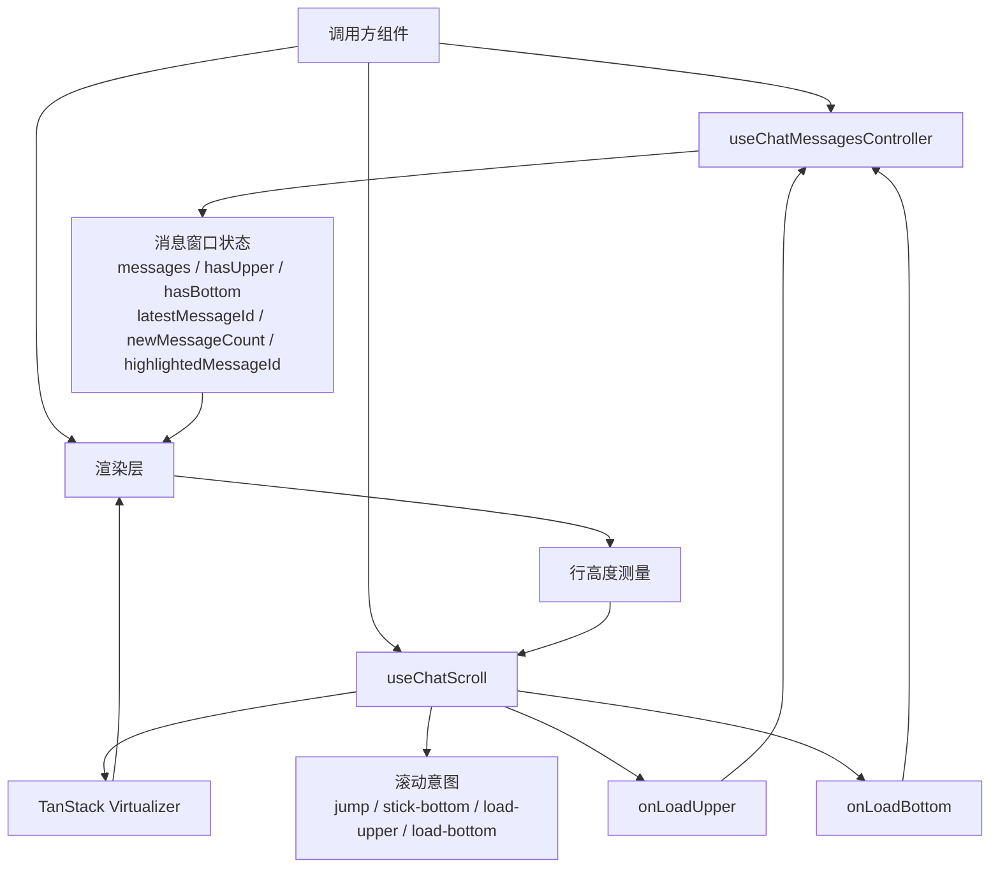

# Chat Scroll Hooks 技术设计

日期：2026-05-18

## 1. 背景与目标

本文只描述 `useChatScroll` 和 `useChatMessagesController` 两个 hook 的技术设计。

目标是为聊天消息列表提供一组可组合的前端能力：

- 虚拟滚动与动态行高测量
- 顶部与底部分页加载
- 重新进入列表时的位置恢复
- 跳转到指定消息
- 消息临时高亮
- 用户离开底部时的新消息计数

本文不覆盖 demo 页面、UI 样式、具体产品页面集成，也不规定服务端分页协议。

## 2. 总体设计

两个 hook 分别管理不同层次的状态：

- `useChatMessagesController` 管理已加载的消息窗口数据状态。
- `useChatScroll` 管理虚拟滚动、滚动意图和滚动位置修正。
- 调用方组件负责连接消息数据、加载回调和渲染层。



这种拆分让数据窗口和 DOM 滚动控制保持独立。调用方可以根据业务数据源决定如何加载消息，也可以根据产品 UI 决定如何渲染每一行。

### 消息窗口

消息窗口指前端当前已经加载并交给 hook 管理的连续消息片段。它不是完整会话历史，也不是当前 DOM 中实际渲染出来的行。

```text
完整会话历史，按时间从旧到新排列

┌────────────────────┬────────────────────────────────┬────────────────────┐
│ 更早但未加载的消息   │ 当前消息窗口 messages[]           │ 更新但未加载的消息   │
│ hasUpper = true    │ oldest ... newest              │ hasBottom = true   │
└────────────────────┴────────────────────────────────┴────────────────────┘
                     │                                │
                     ▼                                ▼
               messages[0]                  messages[messages.length - 1]

虚拟滚动只从当前消息窗口中选择少量行渲染：

messages[] = [ 已加载但未渲染 ][ overscan ][ viewport ][ overscan ][ 已加载但未渲染 ]
```

`useChatMessagesController` 只负责改变消息窗口本身，例如 replace、prepend 或 append。`useChatScroll` 只负责在这个窗口内计算虚拟行、触发边界加载，并在窗口变化后修正滚动位置。

## 3. `useChatMessagesController` 设计

`useChatMessagesController` 负责维护当前已加载消息窗口。

核心状态：

- `messages`：当前已加载的消息数组。
- `hasUpper`：当前窗口之前是否还有更早消息。
- `hasBottom`：当前窗口之后是否还有更新消息。
- `latestMessageId`：会话最新消息 id，用于判断实时消息和底部加载边界。
- `newMessageCount`：用户离开底部期间收到的新消息数量。
- `highlightedMessageId`：当前需要临时高亮的消息 id。

公开操作：

- `replaceWindow(messages, options)`：整体替换当前消息窗口。
- `prependMessages(messages, options)`：把更早消息插入窗口头部。
- `appendMessages(messages, options)`：把更新消息插入窗口尾部。
- `appendRealtimeMessages(messages, options)`：追加实时消息，并可选择是否计入新消息数量。
- `clearNewMessageCount()`：清空新消息计数。
- `highlightMessage(messageId)`：设置临时高亮，并在固定时间后自动清除。

`prependMessages`、`appendMessages` 和 `appendRealtimeMessages` 支持 `guard`。调用方可用 `guard` 检查异步请求返回时的当前消息窗口是否仍符合预期，避免较早的请求覆盖较新的状态。

## 4. `useChatScroll` 设计

`useChatScroll` 负责把消息窗口转换成可虚拟化的滚动模型。

主要输入：

- `messages`：当前消息窗口。
- `getMessageKey`：从消息中取稳定 key。
- `getScrollElement`：返回滚动容器。
- `initialScroll`：初次进入时滚到底部，或按锚点恢复位置。
- `initialFirstUnreadMessageKey`：用于插入首条未读分割行。
- `onLoadUpper` / `hasUpper`：顶部分页加载能力。
- `onLoadBottom` / `hasBottom`：底部分页加载能力。
- `onLatestMessageRead`：最新消息进入已读位置后的回调。

主要返回值：

- `virtualizer`：TanStack Virtualizer 实例。
- `virtualRows`：当前需要渲染的虚拟行。
- `totalHeight`：虚拟列表总高度。
- `onItemSizeAsyncChange()`：异步行高变化后的测量入口。
- `scrollToMessageKey()` / `scrollToMessageIndex()`：滚动到指定消息。
- `scrollToLoadedBottom()`：滚动到当前已加载窗口底部。
- `beginJumpToMessage()`：声明一次消息跳转意图。

虚拟行模型包含四类行：

- `message`：真实消息行。
- `upper-loading`：顶部加载状态行。
- `lower-loading`：底部加载状态行。
- `new-divider`：首条未读消息前的分割行。

`useChatScroll` 使用消息 key 建立真实消息与虚拟行之间的映射。这样即使存在加载行或未读分割行，调用方仍然可以用消息 key 或消息 index 触发滚动。

## 5. 滚动行为设计

顶部加载更早消息：

- 当虚拟渲染范围接近顶部时，触发 `onLoadUpper`。
- 加载前记录第一条可见消息的 key 与它距离 viewport 顶部的偏移。
- 调用方 prepend 数据后，hook 根据锚点恢复滚动位置。

底部加载更新消息：

- 当虚拟渲染范围接近底部且 `hasBottom` 为 true 时，触发 `onLoadBottom`。
- 底部加载完成后，如果用户仍在底部区域，继续保持底部吸附。

底部吸附：

- 如果用户在底部附近，新增消息进入窗口后自动滚到当前已加载底部。
- 如果用户离开底部查看历史，新增消息不改变当前阅读位置。
- 当最新消息重新进入已读位置时，调用 `onLatestMessageRead`。

消息跳转：

- `beginJumpToMessage(targetId)` 会声明当前滚动意图为消息跳转。
- 跳转目标已在 `messages` 中时，可以通过 `scrollToMessageKey` 滚动到目标行。
- 跳转期间会阻止底部吸附或加载完成后的滚动修正抢占位置。

异步行高变化：

- 图片或其他异步内容改变行高后，调用方需要触发 `onItemSizeAsyncChange()`。
- 如果当前意图是保持底部吸附，hook 会重新滚到底部。
- 如果当前处于消息跳转中，则优先保持跳转流程，不执行额外吸附。

## 6. 状态与优先级

`useChatScroll` 内部用 `ScrollPurpose` 描述当前滚动意图：

- `message-jump`：正在跳转到指定消息。
- `stick-at-bottom`：需要保持已加载窗口底部吸附。
- `load-upper`：正在顶部加载，并需要恢复 prepend 前的锚点位置。
- `load-bottom`：正在底部加载更新消息。

滚动控制优先级：

1. `message-jump`
2. `load-upper` / `load-bottom` 完成后的必要位置修正
3. `stick-at-bottom`
4. 用户自然滚动

这个优先级避免多个 effect 同时争夺滚动容器控制权。用户主动离开底部后，hook 会清除底部吸附意图，让后续新增消息不打断阅读。

## 7. 已知边界

- hook 不直接渲染错误 UI，也不规定加载失败后的展示方式。
- hook 不持有服务端分页策略，只通过 `onLoadUpper` 和 `onLoadBottom` 请求调用方加载数据。
- hook 不管理全局会话 store，只处理当前消息窗口和当前滚动实例。
- 跳转到未加载消息需要调用方先加载目标附近数据，再让目标消息进入 `messages`。
- 图片等异步高度变化需要调用方在合适时机触发测量反馈。

## 8. 测试建议

- `useChatMessagesController` 状态转移：替换窗口、头部插入、尾部追加、实时追加和高亮清理。
- `guard` 保护：过期异步请求返回时不应修改当前消息窗口。
- prepend 锚点恢复：头部插入消息后，原第一条可见消息保持在相同视觉位置。
- 底部吸附：用户在底部时新增消息自动滚到底部，离开底部时不改变阅读位置。
- 消息跳转优先级：跳转期间不被底部吸附或加载完成后的滚动修正抢占。
- 新消息计数：用户离开底部时计数增加，回到底部或触发已读回调后清空。
